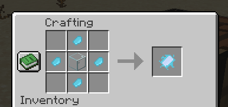
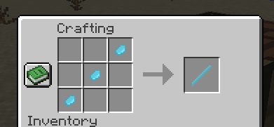

# Mystic Grove

You could find the biome just using /locate command, only if you want...

### Luminite

Luminite is a new ore that can be found in the Mystic Grove Cavers.

And you can use it to craft a Magic Wand and a Mystic Mirror.

The mythic mirror will help to save a location and teleport to it later. 

The magic wand can be used to attract all nearby mobs to you.

### Glowshroom

Glowshroom is a new plant that can be found in the Mystic Grove. 
You can crush it to get Crushed Glowshroom, which can be used to create a permanent light source.

# Ether Blossom

Ether Blossom is a new plant that can be found in the Mystic Grove. Use it to create the health boost potion with an akward potion.
